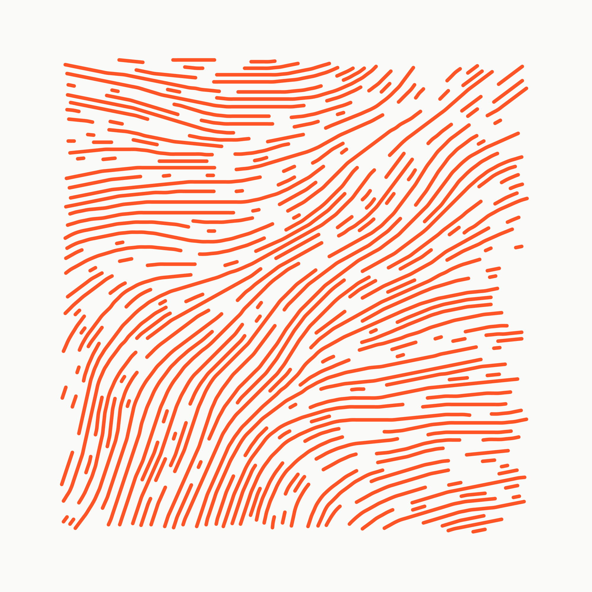

# Algorithmic Dialogs

An ongoing generative art project that explores the possibliities of creating
artworks in dialog with the computer. First a generative algorithm is
implemented by the artist and given to the computer. The output of the algorithm
is than projected onto a canvas to be executed by the artist by hand.

